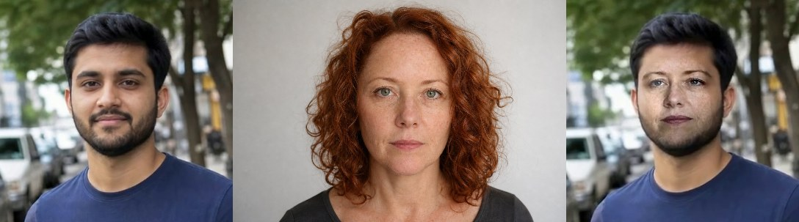

# Historias-IA

## 🎭 Troca de rosto em vídeo

Você envia um **vídeo** e uma **foto** e o programa coloca o rosto da foto na pessoa do vídeo, quadro a quadro. O rosto novo acompanha os movimentos da cabeça, da boca e dos olhos. O áudio original é mantido.


*Esquerda: vídeo original · Meio: foto enviada · Direita: resultado*

### Dois motores

| Motor | Qualidade | Precisa baixar? | Velocidade (CPU, 720p) |
|---|---|---|---|
| **Clássico** (padrão) | boa: deforma a foto sobre uma malha de 468 pontos do rosto, com ajuste de cor e mistura *seamless* | **não**, funciona direto | ~25 quadros/s |
| **IA – inswapper** | muito realista (o mesmo modelo de Roop / FaceFusion / ReActor) | sim, ~700 MB (`python baixar_modelos.py`) | mais lento em CPU (estimativa: poucos q/s), bem mais rápido com GPU |

Com o modo **Automático**, o programa usa a IA quando os modelos estão instalados e, se não estiverem, usa o motor clássico.

### Instalação

```bash
./instalar.sh            # cria o .venv, instala as dependências e tenta baixar os modelos de IA
```
Para instalar manualmente: `pip install -r requirements.txt` e depois `python baixar_modelos.py`.
Se o download falhar, baixe os arquivos pelos links que o script mostra e coloque em `models/`:
- `models/inswapper_128.onnx`
- `models/w600k_r50.onnx` (fica dentro do `buffalo_l.zip`)

### Uso

**Interface web**
```bash
.venv/bin/python app.py          # abre em http://localhost:7860
```
1. Envie o vídeo. 2. Envie a foto. 3. Clique em **Pré-visualizar** para ver um quadro e depois em **Gerar vídeo**.

**Linha de comando**
```bash
.venv/bin/python trocar_rosto.py video.mp4 foto.jpg -o resultado.mp4
.venv/bin/python trocar_rosto.py video.mp4 foto.jpg --motor ia --resolucao 1080 --so-maior
```

### Dicas para um bom resultado
- Use uma foto **de frente**, nítida, bem iluminada e sem óculos escuros.
- Funciona melhor quando o rosto aparece bem no vídeo. Rostos muito de perfil ficam piores.
- O modo `seamless` puxa a iluminação do vídeo. O modo `suave` fica mais fiel às cores da foto.

### O que este projeto NÃO faz (ainda)
Ele troca o **rosto**. Trocar o **corpo inteiro** (roupa, cabelo, corpo, como fazem o Viggle ou o Wan 2.2 Animate) exige modelos de vídeo com ~14 bilhões de parâmetros e uma **GPU com 24–80 GB**. Isso não roda em CPU. Dá para integrar no futuro por uma API paga (Replicate, fal.ai) ou em uma máquina com GPU.

### Uso responsável
Só use o rosto de pessoas que autorizaram. Não use para enganar, difamar, cometer fraude ou criar conteúdo íntimo de ninguém. Em muitos países, incluindo o Brasil, isso é crime. Os modelos InsightFace são liberados **apenas para uso não comercial**.

### Estrutura
```
faceswap/landmarks.py   detecção de rostos + 478 pontos (MediaPipe)
faceswap/classic.py     motor clássico (malha + cor + seamless)
faceswap/ai_swapper.py  motor de IA (inswapper + ArcFace via onnxruntime)
faceswap/video.py       leitura/escrita do vídeo, suavização e áudio (ffmpeg)
app.py + templates/     interface web (Flask)
trocar_rosto.py         linha de comando
baixar_modelos.py       download dos modelos de IA
```
